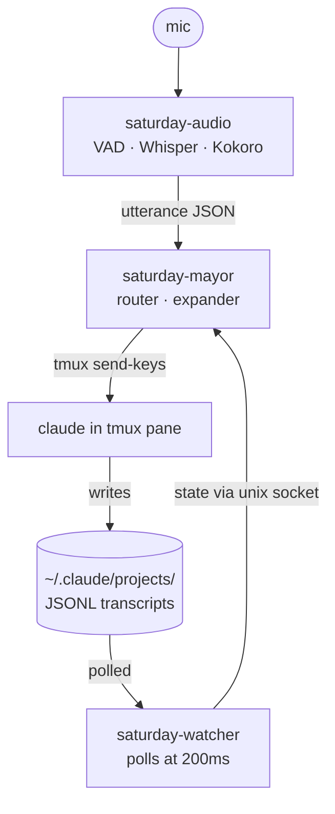

# Saturday

> **⚠️ Research prototype.** Saturday is a single-author experiment, not a
> packaged product. It runs on **Linux + Wayland + tmux** only, expects
> familiarity with [Claude Code](https://docs.claude.com/en/docs/claude-code)
> internals (JSONL files, hooks, autocompact), and will keep your
> microphone open by default. Every utterance becomes a billed Anthropic
> API call. Read the [privacy and cost notes](#privacy-and-cost) before
> running it. Expect breakage; expect the architecture to keep changing.

Saturday is a voice layer for Claude Code. You speak; it transcribes,
picks which of your active sessions you meant, expands the utterance
into a project-grounded prompt, and types it into the live `tmux` pane
running `claude` — without you having to switch windows.



## What a session feels like

A synthetic transcript of one expand-mode exchange. You speak; mayor
narrates routing decisions to its stderr; the target pane (a separate
`claude` running your tests) receives the inject; the completion report
comes back as TTS without you ever looking at it.

First, the stack comes up. The audio pane has focus (rightmost in the
tmux session) since `SPACEBAR`-mute lives there:

```
$ saturday-stack
─── saturday-watcher ───
[ready] sock=/tmp/saturday-watcher.sock, 4 active sessions, polling every 200ms

─── saturday-mayor ───
[hook-sock] listening on /tmp/saturday-mayor-hooks.sock
[state-sock] listening on /tmp/saturday-mayor-state.sock
listening on /tmp/saturday-audio.sock

─── saturday-audio ───
[live]
```

You speak (mic still warm — open by default):

> *"would you kindly check the failing test in lucida"*

The `would you kindly` prefix opts this one utterance into expand mode
(router + expander rewrite, plus a TTS narration). The mayor pane scrolls:

```
← utt (expand, narrate=auto) would you kindly check the failing test in lucida
→ route: lucida (conf=0.93) — name match + recent vitest run in last_assistant_text
→ Saturday → lucida (conf=0.88): "Re-run the lucida test suite and identify the single failing case. Report the test name, its file, and the first 5 lines of its assertion output."
  ↳ found tmux pane %12 for cwd=/home/dev/code/lucida; using tmux send-keys
  ↳ injected via tmux send-keys (live pane handles)
```

The stock ack plays through the speakers within ~50 ms:

> *(TTS, voice af_heart)*  *"On it."*

What lucida's `claude` actually receives is the expansion plus a small
appended system rule that asks for phonetic labels on any enumerated
output — so if the model lists three failures, they come back tagged
*alpha / bravo / cherry*, and a follow-up like *"fix the bravo one"*
routes unambiguously next turn:

```
Re-run the lucida test suite and identify the single failing case.
Report the test name, its file, and the first 5 lines of its assertion
output.

[saturday: when listing more than one item, label each with a phonetically-distinct
callsign — alpha bravo cherry delta echo foxtrot golf hotel — and reuse the same
callsign for the same item across this session. Skip for single-item or pure-prose
answers.]
```

~6 s pass while lucida's `claude` runs `pnpm test` and writes back to
its JSONL. Mayor's polling goroutine catches the size-stable JSONL with
a `text` (not `tool_use`/`thinking`) latest block, pulls
`state.last_assistant_text` from the watcher, and asks Haiku for a
≤15-word past-tense summary:

```
✓ completion report (lucida): "lucida tests done — 17 passed, 1 failed in utterance.test.ts"
```

> *(TTS, voice af_heart)*  *"lucida tests done — 17 passed, 1 failed
> in utterance dot test dot ts"*

You never had to look at the lucida pane.

The lines above are mayor's real stderr format (color codes elided); the
project name and the test output are illustrative. The single appended
system rule is what mayor actually concatenates onto every expand-mode
inject — see `saturday-mayor/main.go::withCallsignRule`.

## Status

| area                 | state                                                                      |
|----------------------|----------------------------------------------------------------------------|
| OS                   | Linux only (developed on Ubuntu 25.10 Wayland). No macOS, no Windows.      |
| Window manager       | Wayland-first. X11 untested.                                               |
| Inject substrate     | `tmux send-keys` is primary. Headless `claude --resume --print` is fallback. |
| STT                  | `faster-whisper small.en`, int8, on CPU.                                   |
| TTS                  | Kokoro-ONNX, default voice `af_heart`.                                     |
| Models               | Anthropic API. `claude-sonnet-4-6` (expander), `claude-haiku-4-5` (router/summarizer). |
| Tests                | Pure-helper coverage only — feedback loop, wake-word, project-name decoding. The orchestration logic is untested. |

What does not currently work, even on the supported stack:

- Anything that requires the target `claude` to **not** be in a tmux pane.
  Mayor finds the pane by walking `/proc`. Outside tmux, it falls back to
  direct-write JSONL append, which only works above the autocompact
  threshold (`--inject-direct-threshold`, default 80k tokens).
- Multi-user concurrency on the same machine. The cross-user playbook in
  `notes/SATURDAY-CROSS-USER.md` (gitignored) is unfinished.
- Recovering gracefully if the audio sidecar disconnects mid-utterance.

## Install

Requires Go 1.26+, Python 3.12+, `tmux`, `portaudio` headers, an
Anthropic API key, and a working microphone.

```bash
git clone https://github.com/justinstimatze/saturday
cd saturday

# Go binaries: saturday-mayor, saturday-watcher, saturday-hook,
# saturday-thinking, saturday-sync. Installs to $(go env GOPATH)/bin.
make install

# Python audio sidecar.
python -m venv saturday-audio/.venv
source saturday-audio/.venv/bin/activate
pip install -r saturday-audio/requirements.txt
deactivate

# Helper launchers (saturday-stack, saturday-claude).
cp bin/saturday-stack bin/saturday-claude "$(go env GOPATH)/bin"

# Anthropic API key — written to XDG config (or eval/.env for dev).
mkdir -p ~/.config/saturday
cat > ~/.config/saturday/config <<'EOF'
ANTHROPIC_API_KEY=sk-ant-...
EOF
```

## Run

Start your interactive `claude` sessions through the `saturday-claude`
wrapper so each one lives in a discoverable tmux pane:

```bash
cd ~/some-project && saturday-claude
```

Then in a separate terminal:

```bash
saturday-stack
```

Three panes come up: `saturday-watcher`, `saturday-mayor`, and the
audio sidecar. The audio pane has focus — `SPACEBAR` toggles mute,
`q` quits.

Speak a project-anchored sentence (e.g. *"check the failing test in
lucida"*). Mayor narrates routing decisions on its stderr; the expanded
prompt lands in the matching tmux pane.

By default the loop is **verbatim** — your transcribed words become the
inject directly, with no LLM expansion. Prefix `"would you kindly"`
(the configurable hotphrase) to opt into expand-mode, where the router
picks the target session and the expander rewrites the utterance into a
project-grounded prompt. (See [What a session feels like](#what-a-session-feels-like)
above for the full transcript shape.)

## How it works

Saturday is a hot loop and a slow loop on top of Claude Code's own
JSONL transcripts:

1. **`saturday-watcher`** polls `~/.claude/projects/<encoded>/*.jsonl`
   at 200 ms, maintains an in-memory "attentional state" snapshot per
   active session (last user turn, last assistant text, last tool use,
   recently modified files), and serves it over a Unix socket. No LLM
   in the hot loop.
2. **`saturday-audio`** is a Python sidecar handling mic capture,
   Silero VAD utterance segmentation, Whisper STT, and Kokoro TTS for
   acks and replies.
3. **`saturday-mayor`** is the orchestrator: receives utterances on a
   Unix socket, queries the watcher for active states, asks the
   **router** (Haiku) which session the utterance refers to, asks the
   **expander** (Sonnet) to produce an injectable prompt, then
   `tmux send-keys`'s it into the target pane.
4. **`saturday-sync`** is a `UserPromptSubmit` Claude Code hook
   installed in each session. When Saturday writes a turn out-of-band
   (the autocompact-divert path), the hook re-injects that context to
   the live pane on the user's next interaction so the in-memory
   transcript stays coherent.
5. **`saturday-thinking`** is an optional TUI that subscribes to
   mayor's state socket and renders its current cognitive state as a
   bordered-cards FUI (sci-fi HUD register).

See [`INJECTION.md`](INJECTION.md) for the design rationale behind the
inject substrate and [`ROADMAP.md`](ROADMAP.md) for the version arc.

## Privacy and cost

- **Open mic by default.** The audio sidecar listens continuously when
  unmuted. Hit `SPACEBAR` in the audio pane to toggle mute (hard cutoff
  before STT — nothing logged, nothing transcribed).
- **Local transcripts.** Every transcribed utterance lands in
  `~/.claude/saturday/transcripts/YYYY-MM-DD.log` for debugging. The
  files never leave the machine, but they accumulate forever unless
  you rotate them.
- **Every utterance is a billed API call.** A routine ~5-word
  utterance fires one Haiku router call plus one Haiku or Sonnet
  expander call (~$0.001-$0.01 depending on session-state size,
  cache-warm). Open-mic + chatty days add up.
- **Multi-user host warning.** Mayor and watcher listen on
  `/tmp/saturday-*.sock` with `0666` perms so the cross-user inject
  path can work. **Do not run this on a shared host.** Any local
  account can dispatch utterances into your `claude` panes.

## Codename glossary

| name               | what                                                                  |
|--------------------|-----------------------------------------------------------------------|
| **mayor**          | the orchestrator binary (`saturday-mayor`)                            |
| **watcher**        | session-state poller (`saturday-watcher`)                             |
| **sync hook**      | `UserPromptSubmit` hook surfacing out-of-band injects (`saturday-sync`) |
| **bridge hook**    | tiny binary forwarding CC hook events to mayor's socket (`saturday-hook`) |
| **expander**       | LLM rewrite of a raw utterance into a project-grounded prompt         |
| **router**         | LLM pick of which active session an utterance refers to               |
| **summarizer**     | LLM 1-sentence rolling session arc (slow loop, ≥5 min cadence)        |
| **completion report** | spoken status callback after an inject's downstream work settles    |
| **hotphrase**      | leading phrase that opts an utterance into expand-mode (default `would you kindly`) |
| **callsigns**      | phonetic labels (alpha/bravo/...) the expander asks CC to attach to enumerated items, so voice references like *"the bravo one"* resolve |
| **effigy**         | the persona file at `llmcore/saturday.effigy` appended to expander + summarizer prompts |
| **ask-mode**       | route where Saturday answers a question itself from session arcs instead of relaying to a CC session |
| **das blinkenlights** | mid-height status tag overlaid on the target CC pane during the inject lifecycle |

## Development

```bash
make build      # build all binaries into ./bin/ with -ldflags version
make install    # build to $(go env GOPATH)/bin
make ci         # gofmt + vet + test -race + build (mirrors CI)
make hooks      # wire .githooks/pre-commit so commits run `make ci`
make test       # short test pass, no race
make tidy       # go mod tidy across modules
```

The pre-commit hook and the GitHub Actions workflow both call `make ci`,
so a clean local commit ≈ a green CI run. Use `git commit --no-verify`
(or `SATURDAY_SKIP_PRECOMMIT=1 git commit`) to bypass for in-progress
work.

## License and security

[MIT](LICENSE). Security disclosures: [SECURITY.md](SECURITY.md)
(`justin@justinstimatze.com`).
